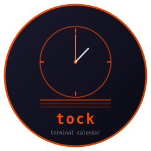

# tock



**The fast terminal calendar. Written in Rust.**

   

Terminal calendar with week view, event management, astronomy, and weather. Built on [Crust](https://github.com/isene/crust). Feature clone of [Timely](https://github.com/isene/Timely) rewritten in Rust for speed and single-binary distribution.

## Features

- **5-pane TUI**: info bar, mini-month strip, week view grid, event details, status bar
- **Week view**: 7-column layout with half-hour time slots, all-day event rows, weather per day
- **Mini-month calendars**: horizontal strip with event indicators, week numbers, today highlight
- **Calendar sources**: Google Calendar (OAuth2), Outlook/365 (device auth), local events
- **ICS import**: parse and import .ics files with RRULE expansion for recurring events
- **Background sync**: automatic polling with configurable intervals
- **Astronomy**: moon phase with emoji symbols, sunrise/sunset, solstices, meteor showers
- **Weather**: 7-day forecast from Met.no (free, no API key)
- **Desktop notifications**: configurable alarms via notify-send
- **Event management**: create, edit, delete, accept invites (RSVP)
- **Preferences**: 15 configurable settings with inline color picker (256-color grid)
- **Calendar manager**: enable/disable calendars, change colors, remove
- **Shared database**: uses the same SQLite DB as Timely (~/.timely/timely.db)

## Install

Download the prebuilt binary from [Releases](https://github.com/isene/tock/releases), or build from source:

```bash
cargo build --release
cp target/release/tock ~/.local/bin/
```

## Key Bindings

| Key | Action |
|-----|--------|
| d/RIGHT, D/LEFT | Next/prev day |
| w/W | Next/prev week |
| m/M | Next/prev month |
| y/Y | Next/prev year |
| UP/DOWN | Navigate time slots |
| PgUp/PgDn | Jump 10 slots |
| HOME/END | Top/bottom of day |
| j/k | Cycle events on day |
| e/E | Jump to next/prev event |
| t | Go to today |
| g | Go to date |
| n | New event |
| Enter | Edit event |
| x/DEL | Delete event |
| v | View event details |
| a | Accept invite (RSVP) |
| Ctrl+Y | Copy event to clipboard |
| i | Import ICS file |
| G | Setup Google Calendar |
| O | Setup Outlook/365 |
| S | Manual sync |
| C | Calendar manager |
| P | Preferences |
| Ctrl+R | Clear caches |
| Ctrl+L | Redraw |
| ? | Help |
| q | Quit |

## Configuration

Config file: `~/.timely/config.yml` (shared with Timely)

Settings include location (for astronomy/weather), work hours, calendar colors, sync intervals, and notification preferences.

## Dependencies

Runtime: SQLite (bundled). Optional: `notify-send` (notifications), `xclip` (clipboard).

## Part of the Rust Terminal Suite

| Tool | Clones | Description |
|------|--------|-------------|
| [rush](https://github.com/isene/rush) | [rsh](https://github.com/isene/rsh) | Shell |
| [crust](https://github.com/isene/crust) | [rcurses](https://github.com/isene/rcurses) | TUI library |
| [kastrup](https://github.com/isene/kastrup) | [Heathrow](https://github.com/isene/heathrow) | Messaging hub |
| [tock](https://github.com/isene/tock) | [Timely](https://github.com/isene/timely) | Calendar |
| [pointer](https://github.com/isene/pointer) | [RTFM](https://github.com/isene/RTFM) | File manager |
| [scroll](https://github.com/isene/scroll) | [brrowser](https://github.com/isene/brrowser) | Web browser |
| [crush](https://github.com/isene/crush) | - | Rush config helper |

## License

[Unlicense](https://unlicense.org/) - public domain.

## Credits

Created by Geir Isene (https://isene.org) with extensive pair-programming with Claude Code.
